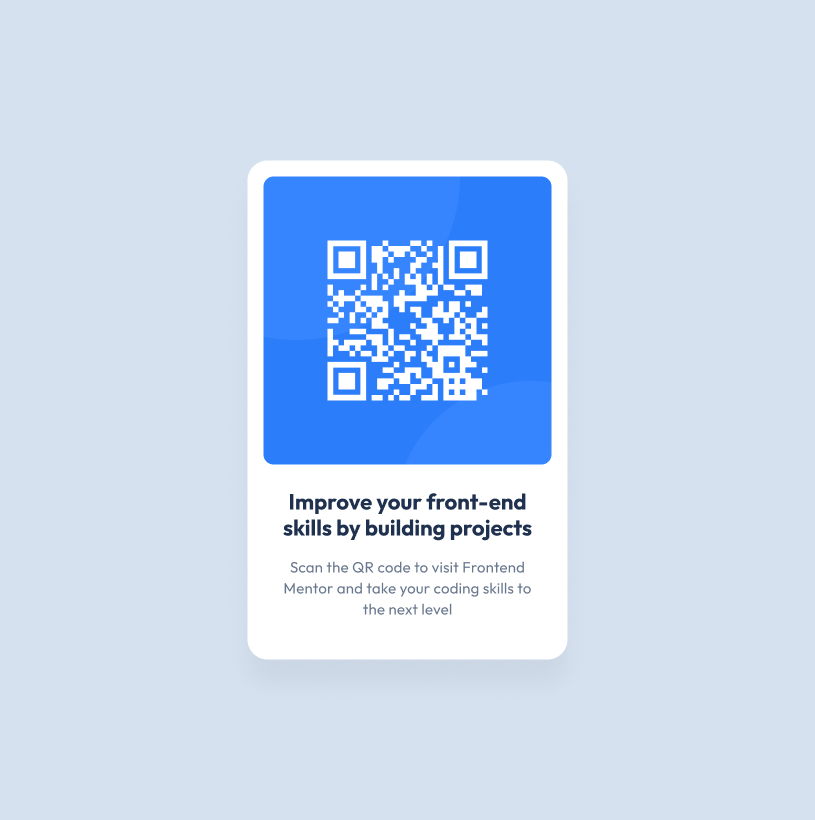

# QR Code Component
  

## 📸 Visualização


---

Este é um projeto de componente de QR Code, desenvolvido como parte de um desafio do [Frontend Mentor](https://www.frontendmentor.io/).  
O objetivo é praticar **HTML5**, **CSS3** e o uso de um **Design System** com medidas, espaçamentos, cores e tipografia específicas, buscando atingir o resultado mais próximo possível do design original (pixel perfect).

---

## 🎯 Objetivo do Projeto
- Construir um **cartão centralizado** com QR Code.  
- Aplicar medidas exatas de **largura e altura** no container, imagem e textos.  
- Respeitar o **Design System** fornecido (cores, espaçamento e tipografia).  
- Garantir responsividade mínima para exibição correta em dispositivos móveis e desktop.

---

## 📐 Especificações do Design System

### 📏 Layout
- **Container:** `320px` (largura) × `499px` (altura)  
- **Imagem QR:** `288px` × `288px`  
- **Borda Container:** `20px`  
- **Borda Imagem:** `10px`  
- **Espaçamento interno (padding):** `16px`  
- **Margens entre elementos:**  
  - Imagem → textos: `24px`  
  - Título → parágrafo: `16px`  

### 🎨 Cores
- **Slate-900:** `#1F314F` → usado no título (`h1`)  
- **Slate-500:** `#7D889E` → usado no parágrafo (`p`)  
- **Slate-300:** `#D3E1EF` → cor de fundo da página  
- **White:** `#FFFFFF` → fundo do container  

### ✍️ Tipografia
- Fonte: **Outfit** (Google Fonts)  
- Título (`h1`):  
  - Tamanho: `22px`  
  - Peso: `700`  
  - Line-height: `120%`  
- Parágrafo (`p`):  
  - Tamanho: `15px`  
  - Peso: `400`  
  - Line-height: `140%`  

---

## 🚀 Tecnologias Utilizadas
- **HTML5** → Estrutura do conteúdo  
- **CSS3** → Estilização e responsividade  
- **Google Fonts** → Tipografia (Outfit)

---


## 📂 Estrutura de Arquivos
```bash
.
├── index.html
├── style.css
├── assets
│   ├── QR-image.png
│   └── preview.png
└── README.md
